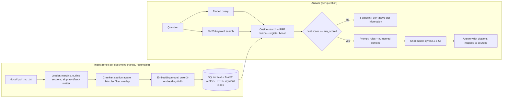

# STM32 Local RAG Assistant

A fully offline question-answering assistant for STM32 documentation, built
with **Microsoft Foundry Local** and the **Retrieval-Augmented Generation
(RAG)** pattern. Put the reference manual (RM0090, ~1700 pages) and/or a board
user manual (UM1472 for the STM32F407G-DISC1) in `docs/`, index them once, and
ask questions in the terminal or a local web UI.
Answers are grounded in the manual, cite file + page + section, and the
assistant says so when the manual does not contain the answer.

No cloud, no API keys, no GPU required. Internet is needed only once, to
download the models.

```
You: What is the reset value of GPIOA_MODER?
Assistant: The reset value of GPIOA_MODER is 0xA800 0000 [1].

  Sources:
   [1] rm0090.pdf, p. 283 - 8.4.1 GPIO port mode register (GPIOx_MODER) (x = A..I/J/K)  (score 0.71; vector #1, keyword #1)
  [retrieval 45 ms | first token 1.30s | generation 3.10s | best score 0.712]
```
*(illustrative output - the page and section are real (RM0090 Rev 22); scores and timings depend on your machine)*

---

## Contents

1. [How it works](#how-it-works)
2. [Requirements](#requirements)
3. [Setup](#setup)
4. [Quick start](#quick-start)
5. [Usage](#usage)
6. [Evaluation](#evaluation)
7. [Tests](#tests)
8. [Configuration](#configuration)
9. [Troubleshooting](#troubleshooting)
10. [Project layout](#project-layout)
11. [Design decisions and limitations](#design-decisions-and-limitations)

---

## How it works



1. **Load & clean** - PDFs are read with PyMuPDF in visual reading order.
   Running headers/footers ("RM0090 Rev 22 283/1741") are dropped by their
   position in the page margins. Section titles and their exact positions come
   from the PDF outline (bookmarks); whole front/back-matter chapters
   (contents, lists of tables/figures, index, revision history, legal notice)
   are skipped. PDFs without an outline fall back to numbered-heading
   detection.
2. **Chunk** - text is split into ~1200-character passages. Every heading
   starts a new chunk; the chunk remembers its section and chapter and its page
   range. Register bit rulers ("31 30 29 ...", "rw rw rw ...", reset bit rows)
   are dropped - the bit *descriptions* stay.
3. **Embed & store** - each chunk (prefixed with "chapter > section") is turned
   into a vector by `qwen3-embedding-0.6b` via Foundry Local, L2-normalised and
   stored in SQLite as a float32 BLOB, plus an FTS5 keyword index. Ingestion is
   incremental (SHA-256 per file) and resumable (committed in batches).
4. **Retrieve (hybrid)** - the question is embedded with Qwen3's query
   instruction and compared with all chunks (one matrix-vector product =
   cosine similarity); in parallel an FTS5/BM25 keyword search runs (Porter
   stemming, prefix matching). The two rankings are fused with Reciprocal Rank
   Fusion, and if the question names a register (`GPIOD_MODER`, `USART2_SR`)
   the section describing it (`GPIOx_MODER`, `USART_SR`) gets a boost.
5. **Gate** - if the best score is below `min_score`, the LLM is not called
   at all and the assistant declines.
6. **Augment** - the top-k chunks are numbered `[1]..[k]` (file, page,
   section) and put into the user message; the system prompt demands
   answers *only* from these passages, `[n]` citations, and an exact
   fallback sentence when the answer is missing.
7. **Generate** - the local chat model streams the answer; `[n]` markers are
   mapped back to their sources.

## Requirements

| | |
|---|---|
| Python | 3.11 - 3.14 |
| OS | Windows x64/ARM64, macOS Apple Silicon, Linux x64 (Foundry Local SDK v2 wheels) |
| RAM | 8 GB minimum, 16 GB recommended |
| Disk | a few GB for the models (cached after the first download) |
| Network | only for the first model download; everything else is offline |

Intel Macs are not supported by the Foundry Local SDK v2.

## Setup

```bash
python -m venv .venv
# Windows (PowerShell):  .venv\Scripts\Activate.ps1
# macOS / Linux:         source .venv/bin/activate
pip install -r requirements.txt
```

If PowerShell refuses to run the activation script:
`Set-ExecutionPolicy -Scope CurrentUser RemoteSigned`.

Verify Foundry Local:

```bash
python exercises/hello_model.py         # downloads a tiny model, prints a greeting
```

## Quick start

```bash
# 1. put the manual(s) into docs/ - short file names make nicer citations:
#    docs/rm0090.pdf (reference manual), docs/um1472.pdf (board user manual)
python main.py ingest --dry-run        # preview: pages, skipped pages, chunks (~10 s for RM0090)
python main.py ingest                  # build the index (downloads the embedding model once)
python main.py chat                    # ask questions (downloads the chat model once)
```

**Large manuals.** RM0090 gives about 3,300 chunks. Embedding them is the
slow step: on a CPU-only laptop expect anywhere from tens of minutes to a few
hours (a GPU/NPU is much faster). `ingest` prints the rate and an ETA after
every batch, and it is **resumable** - stop it with Ctrl+C (or let the laptop
sleep) and run `python main.py ingest` again to continue where it stopped.
This is a one-time cost; afterwards unchanged files are skipped instantly.

## Usage

| Command | What it does |
|---|---|
| `python main.py ingest` | index new/changed files in `docs/`, drop deleted ones |
| `python main.py ingest --force` | rebuild the whole index |
| `python main.py ingest --dry-run` | load + chunk only, print statistics |
| `python main.py stats` | documents, chunk counts, embedding model |
| `python main.py inspect um1472.pdf --page 14` | print stored chunks (debug chunking) |
| `python main.py chat [--show-context] [--top-k N] [--source F]` | interactive Q&A with streaming |
| `python main.py ask "question" [--show-context] [--source F]` | one question, then exit |
| `python main.py eval [--questions FILE] [--source F]` | run an evaluation set, write a report |
| `streamlit run app.py` | web UI on http://localhost:8501 |

In `chat`: `/context` toggles printing of retrieved chunks (with how each was
found: `vector #n`, `keyword #n`), `/reload` picks up a new ingest without
restarting, `/quit` exits. `--source rm0090.pdf` (repeatable) restricts the
search to some documents - useful when both the board manual and the
reference manual are indexed.

The web UI offers the same pipeline with a document filter, sliders for top-k
and the minimum similarity, an expandable view of the retrieved context, and
example questions.

### Offline plumbing mode

`--fake-embedder` / `--fake` swap in a hashing embedder and an extractive fake
"LLM" (`rag/testing.py`). They have no language understanding, but let you
test the whole pipeline on a machine without Foundry Local:

```bash
python main.py ingest --fake-embedder
python main.py chat --fake
RAG_FAKE=1 streamlit run app.py        # PowerShell: $env:RAG_FAKE=1; streamlit run app.py
```

Switch back with a normal `python main.py ingest` - the index is rebuilt
automatically because the embedding model changed.

## Evaluation

Two question sets are included:

| File | Document | Questions |
|---|---|---|
| `eval/questions_rm0090.json` (default) | RM0090 Rev 22 | 24 answerable (GPIO, RCC, USART, DMA, EXTI, NVIC, ADC, RTC, IWDG, CRC, flash, PLL) + 5 unanswerable; every expected answer was checked against the PDF (section/page in `note`) |
| `eval/questions_um1472.json` | UM1472 | 15 answerable + 5 unanswerable; **draft keywords - verify against your PDF revision** |

`u02` in the RM0090 set asks about the Discovery board's LEDs, which are
documented in UM1472, not in RM0090 - it is only "unanswerable" when RM0090 is
the only document searched. With both manuals indexed, run
`python main.py eval --source rm0090.pdf`.

```bash
python main.py eval --source rm0090.pdf                  # 29 questions
python main.py eval --questions eval/questions_um1472.json --source um1472.pdf
python main.py eval --limit 5                            # quick check
RAG_HYBRID=0 python main.py eval --source rm0090.pdf     # compare with vector-only search
```

Output: `eval/results/report-<time>.md` (summary + every answer) and a CSV
with a `manual_review` column. Metrics:

| Metric | Meaning |
|---|---|
| Answer accuracy | answerable questions whose answer contains all expected keywords |
| Retrieval hit | the expected keywords were in the retrieved chunks |
| False declines | answerable questions the assistant refused |
| Decline accuracy | unanswerable questions correctly declined |
| Citation rate | non-declined answers with at least one valid `[n]` |
| Latency | retrieval, first token, total (mean / median / p95) |
| Suggested `min_score` | retrieval-score threshold that best separates answerable from unanswerable questions |

How to read it: *retrieval hit = yes* but a wrong answer points at the
prompt or the model; *retrieval hit = no* points at chunking, embedding or
`top_k`. Apply the suggested threshold with `RAG_MIN_SCORE=...` and re-run.

Question file format:

```json
{"id": "a01", "answerable": true,
 "question": "Which pin is the user push-button B1 connected to?",
 "must_include": [["PA0"]]}
```
Every inner list is a group of alternatives; all groups must match. Matching
ignores case and whitespace (`"5 V"` = `"5V"`).

## Tests

```bash
pip install -r requirements-dev.txt
python -m pytest
```

71 tests, fully offline (fake models + two synthetic ST-style PDFs in
`tests/fixtures/`, one with a bookmark outline): margin/header removal,
outline sections, skipped front/back matter, bit-ruler filtering, chunking,
SQLite and FTS5 (stemming, cleanup, schema migration), incremental and
*interrupted-then-resumed* ingestion, hybrid retrieval, register boost,
document filters, prompt/citation parsing, the gate, edge cases (empty/very
long questions, empty model output, index/model mismatch), the evaluation
metrics, the Streamlit UI (multi-turn, multi-thread, document filter) and the
Foundry SDK glue code. Real model inference is checked on your machine by
`exercises/hello_model.py` and `python main.py eval`.

## Configuration

Defaults are in `rag/config.py`; every value can be overridden with an
environment variable (`export RAG_TOP_K=4`, PowerShell: `$env:RAG_TOP_K=4`).

| Variable | Default | Purpose |
|---|---|---|
| `RAG_CHAT_MODEL` | `qwen2.5-1.5b` | Foundry Local chat model alias (`python exercises/hello_model.py --list`) |
| `RAG_EMBEDDING_MODEL` | `qwen3-embedding-0.6b` | embedding model alias (changing it triggers a rebuild) |
| `RAG_TOP_K` | `4` | chunks given to the model |
| `RAG_HYBRID` | `1` | `0` = vector search only (no keyword search / fusion) |
| `RAG_CANDIDATE_POOL` | `30` | candidates from each search before fusion |
| `RAG_MIN_SCORE` | `0.25` | retrieval gate; `0` disables it - calibrate with `eval` |
| `RAG_TEMPERATURE` | `0.1` | sampling temperature (low = factual) |
| `RAG_MAX_OUTPUT_TOKENS` | `512` | answer length limit |
| `RAG_CHUNK_MAX_CHARS` / `_MIN_CHARS` / `_OVERLAP_CHARS` | `1200` / `300` / `200` | chunking (re-ingest with `--force` after changing) |
| `RAG_EMBED_BATCH_SIZE` | `16` | chunks per embedding request |
| `RAG_QUERY_INSTRUCTION` | Qwen3 instruction | prefix for query embeddings; `""` disables |
| `RAG_DOCS_DIR`, `RAG_DB_PATH` | `docs/`, `data/rag.sqlite3` | locations |
| `RAG_MODEL_CACHE_DIR` | SDK default | where models are stored |

## Troubleshooting

| Symptom | Fix |
|---|---|
| `Model '...' was not found in the Foundry Local catalog or local cache` | first run needs internet; check the alias with `hello_model.py --list` |
| `Index was built with 'X', but this run uses 'Y'` | run `python main.py ingest` (use `--fake-embedder` only together with `--fake`) |
| `No database found` / `database is empty` | `python main.py ingest` |
| `no extractable text - scanned PDF?` | the PDF has no text layer; OCR is not supported - use the text PDF from st.com |
| `stats` shows `PARTIAL 1200/3293` | an ingest was interrupted - run `python main.py ingest` to resume |
| `Database schema upgraded - the index is rebuilt` | expected once after updating the project; ingest refills it |
| Register questions miss the right section | ask with the register name (`GPIOx_MODER`, `RCC_AHB1ENR`) - keyword search and the register boost use it |
| Answers mix up F405/407 and F42x/43x values | RM0090 covers both families (e.g. RCC is chapter 6 for F42x/43x, chapter 7 for F405/407); name your device in the question |
| Answers are slow | smaller chat model (`RAG_CHAT_MODEL=qwen2.5-1.5b`), lower `RAG_TOP_K`, or `RAG_MAX_OUTPUT_TOKENS=256` |
| Declines questions it should answer | look at `--show-context`: right chunk missing → raise `RAG_TOP_K`; score below the gate → lower `RAG_MIN_SCORE` |
| Wrong answer although the right chunk was retrieved | try a larger chat model; inspect the chunk with `main.py inspect` (PDF tables lose their layout) |
| Turkish questions give weaker answers | phi-3.5-mini is weak in Turkish; ask in English or try a Qwen chat model |

## Project layout

```
main.py                 CLI: ingest / stats / inspect / chat / ask / eval
app.py                  Streamlit web UI
rag/
  config.py             settings + RAG_* environment overrides
  foundry.py            Foundry Local SDK v2 wrapper: Embedder, ChatModel
  loaders.py            PDF (PyMuPDF: margins, outline, skipped chapters) / MD / TXT
  chunker.py            section-aware chunking, bit-ruler filter, overlap, page ranges
  store.py              SQLite: float32 BLOB vectors, FTS5 index, resumable writes
  ingest.py             incremental + resumable ingestion with progress/ETA
  retrieval.py          hybrid search: cosine + BM25, RRF fusion, register boost
  prompts.py            system prompt, context formatting, citation parsing
  assistant.py          RagAssistant: prepare -> generate -> finalize
  evaluation.py         metrics, threshold suggestion, Markdown/CSV reports
  testing.py            offline hashing embedder + extractive fake chat model
exercises/              weeks 1-2: hello_model, embedding_demo, sqlite_sandbox
eval/                   question sets (RM0090, UM1472); results/ is created by `main.py eval`
tests/                  pytest suite + fixtures (synthetic manuals)
report/                 project report and presentation outline
docs/                   your documents (PDFs are git-ignored)
data/                   SQLite database
```

## Design decisions and limitations

See [`report/PROJECT_REPORT.md`](report/PROJECT_REPORT.md) for the full
discussion. In short:

- Uses the **Foundry Local SDK v2 session API** (`ChatSession`,
  `EmbeddingsSession`); the `get_chat_client()` / `get_embedding_client()`
  helpers from older tutorials are deprecated and scheduled for removal at
  the end of 2026.
- **Two layers against hallucination**: a retrieval-score gate before the
  LLM, and strict prompt rules with an exact fallback sentence.
- **Hybrid retrieval**: embeddings capture meaning, BM25 captures exact
  register/bit names; RRF merges them without score tuning. On RM0090 with
  the offline test embedder, hybrid search raised the retrieval hit rate from
  42% to 88% on the evaluation set.
- **Brute-force numpy search** over SQLite-stored vectors - exact and about
  0.5 ms for RM0090's ~3,300 chunks; a vector database would only pay off at
  much larger scale.
- Limitations: tables (register maps, pin tables) and figures lose their
  layout; scanned PDFs are not supported; each question is answered
  independently (no follow-up memory); keyword-based evaluation is a proxy
  for human review.

## References

- Microsoft Tech Community - *Building Your First Local RAG Application with Foundry Local*
- Microsoft Learn - *Tutorial: Build a RAG application* (Foundry Local)
- `foundry-local-sdk` on PyPI - Python SDK v2 documentation
- STMicroelectronics RM0090 Rev 22 - *STM32F405/415, STM32F407/417, STM32F427/437 and STM32F429/439 reference manual*
- STMicroelectronics UM1472 - *Discovery kit with STM32F407VG MCU*
